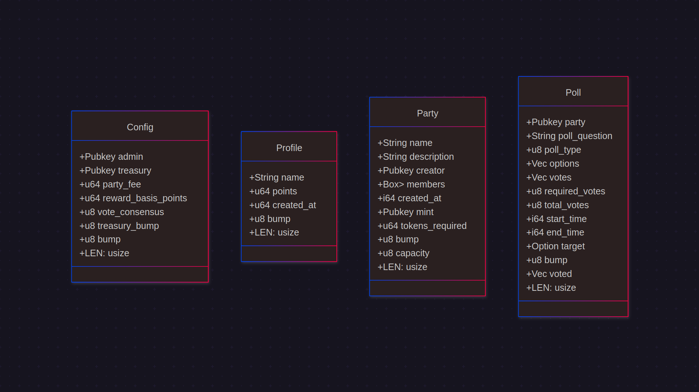
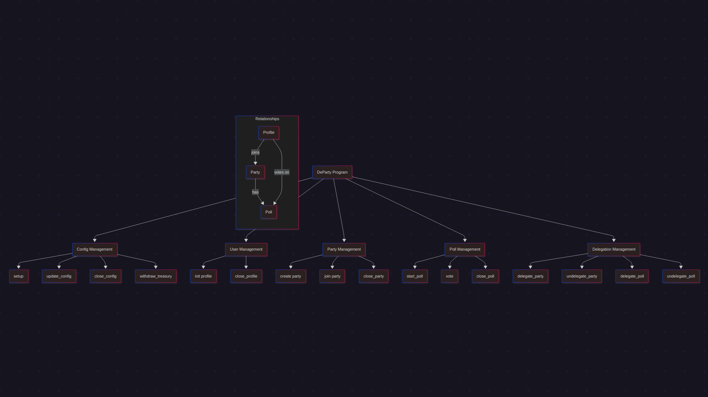

# DeParty - Token-Gated Video Communities with On-Chain Governance


DeParty combines video conferencing with decentralized governance and token-gated access, powered by Solana and MagicBlock's Ephemeral Rollups technology for near-instant finality.

## Live Demo

The application is deployed and live at: [DeParty - The Hub for Degen Parties](https://departy.vercel.app/)

Video preview of the protocol: [Demo](https://x.com/kira_risk/status/1923594195404496914)

Program ID on Devnet: ParTyJHHCxDHCZkeXBZTAtMQT1t1eospvjgYdpYQmHb

## Project Overview

DeParty is a decentralized application that enables users to:

- Create token-gated party rooms that require specific tokens/NFTs for access
- Host live video meetings with other party members through LiveKit integration
- Create and vote on polls for community decision-making
- Enjoy fast transaction confirmation through Ephemeral Rollups
- Manage user profiles with on-chain identity
- Delegate parties and polls to Ephemeral Rollups for sub-second operations

## Key Features

- **Token-Gated Access**: Create parties that require ownership of specific tokens to join
- **Live Video Meetings**: Integrated LiveKit video conferencing within party rooms
- **On-Chain Governance**: Create polls, vote, and automatically execute decisions when thresholds are reached
- **Dual-Layer Architecture**: Operations on both Solana base layer and Ephemeral Rollups
- **Fast Transactions**: Sub-second confirmation times for most operations
- **User Profiles**: On-chain identity management

## Technical Architecture

DeParty uses a multi-layer architecture:

1. **Base Layer (Solana)**: Handles secure state storage, token verification, and user authentication
2. **Ephemeral Rollup Layer**: Provides near-instant finality for party operations and polls
3. **Frontend Interface**: React application with LiveKit integration for video conferencing
4. **Smart Contract**: Anchor program that manages party creation, polls, and governance

## Technologies Used

- **Blockchain**:
  - Solana Blockchain
  - MagicBlock Ephemeral Rollups
  - Anchor Framework
  - Solana Web3.js & Wallet Adapter

- **Frontend**:
  - Next.js
  - React
  - TailwindCSS
  - React Query

- **Video Conferencing**:
  - LiveKit for real-time video and audio
  - WebRTC

## Prerequisites

Ensure you have the following installed:

- **Rust**: `rustc 1.82.0` or later
- **Solana CLI**: `solana-cli 2.1.21` or later
- **Anchor CLI**: `anchor-cli 0.31.1`
- **Node.js**: `v20.10.0` or later
- **npm**: `11.3.0` or later

## Building and Testing Locally

1. **Clone the Repository**
   ```bash
   git clone https://github.com/kirarisk/DeParty.git
   cd DeParty
   ```

2. **Install Dependencies**
   ```bash
   # Install Anchor program dependencies
   cd de-party-ER/
   npm install
   
   # Install frontend dependencies
   cd ../frontend
   npm install
   ```

3. **Build the Anchor Program**
   ```bash
   cd ../de-party-ER
   anchor build
   ```

4. **Run Tests**
   ```bash
   anchor test
   ```

5. **Run the Frontend**
   ```bash
   cd ../frontend
   npm run dev
   ```

## Project Structure

```
DeParty/
├── de-party-ER/         # Solana smart contract (Anchor program)
│   ├── programs/        # Core program logic
│   │   └── de-party/    # Solana program implementation
│   ├── tests/           # Smart contract tests
│   └── Anchor.toml      # Anchor configuration
│
├── frontend/            # Next.js frontend application
│   ├── public/          # Static assets
│   └── src/             # Source code
│       ├── components/  # React components
│       │   ├── cluster/ # Solana cluster configuration
│       │   ├── dashboard/ # Main dashboard UI and data access
│       │   ├── livekit/ # LiveKit video conferencing integration
│       │   └── solana/  # Solana wallet integration
│       └── app/         # Next.js app router
```

## Key Workflows

## States Class Diagram



## Instructions Diagram


### Party Creation and Joining
1. User connects their wallet and creates a profile
2. User creates a new party by specifying a token, token amount, and member limit
3. Party is created on Solana and delegated to the Ephemeral Rollup
4. Other users can join the party if they hold the required token amount
5. Upon joining, users can enter the video chat room

### Poll Creation and Voting
1. Party creator or members can create polls (General, Mute, Kick)
2. Polls are stored on-chain and can be delegated to Ephemeral Rollups
3. Party members can vote on active polls
4. When the required vote threshold is reached, the poll is closed automatically
5. Poll results can be used to execute moderation actions

## Performance Comparison

| Feature               | Traditional Solana| With Ephemeral Rollups |
|-----------------------|-------------------|------------------------|
| Party Creation        | ~6 seconds        | ~400ms                 |
| Joining a Party       | ~3.5 seconds      | ~300ms                 |
| Poll Creation         | ~3 seconds        | ~200ms                 |
| Voting                | ~2 seconds        | ~100ms                 |
| Poll Resolution       | ~5 seconds        | ~10ms                  |

## LiveKit Integration

DeParty uses LiveKit for real-time video conferencing:

- Seamless integration with Solana wallet for authentication
- Party rooms automatically generate LiveKit rooms
- Participants can toggle video/audio and screen sharing
- Chat alongside video conferencing
- Polls appear directly in the video interface

## Future Roadmap

- End-to-end encrypted messaging
- More granular token-gating options
- Rewards system and DAO management
- Mobile application support
- Enhanced moderation tools
